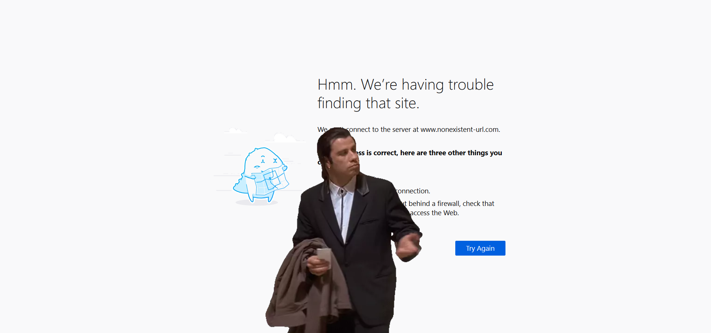

# Firefox Travolta meme patch

Who wouldn't want confused Travolta gif in their browser when they visit a page that does not exist?
That's right **everyone** wants that.

Just look at it, it's beautiful:

Afterwards just visit any nonexistent URl (like http://www.nonexistent-url.com) and be mesmerized by its beauty.

## Installation

If your immediate reaction was "wow, that's so cool, I want it in my Firefox like yesterday!!!1!1!", today is your lucky
day.

Just had to the [latest release](https://github.com/RikudouSage/FirefoxTravoltaMemePatch/releases/latest), download the
installer and run it. That's how easy it is.

> After every Firefox update this patch will be undone and needs to be installed again.

## Uninstallation

Why would someone uninstall this? Whatever your reason may be, just head to your Firefox installation directory
(default is `C:\Program Files\Mozilla Firefox`), then open directory `browser` and delete the `omni.ja` file. Afterwards
rename the file `omni.ja.backup` to `omni.ja`.

If this is too technical for you, just [download Firefox installer](https://www.mozilla.org/firefox/download/thanks/)
and install it (you don't need to uninstall it first and your data won't be deleted).

## Technical details

> This section is only if you're interested in how it works, you don't need to read it if you just want to use it.

Pretty much all content of Firefox (including its error pages) is in a zip archive `omni.ja` inside the
`{FirefoxDir}\browser\` folder.

The installer does this, step by step:

1. Copies the [image](travolta.webp) and programs for zipping and unzipping into a temporary directory
2. Finds the directory where your Firefox is installed and asks you for confirmation
3. Copies the `omni.ja` archive to temporary directory
4. Extracts the archive
5. Copies the confused Travolta image into the extracted archive directory and modifies html and css files that
correspond to the error page
    - `chrome\browser\skin\classic\browser\aboutNetError.css` contains the CSS
    - `chrome\browser\content\browser\aboutNetError.xhtml` contains the HTML
6. Compresses the uncompressed archive according to [documentation](https://developer.mozilla.org/en-US/docs/Mozilla/About_omni.ja_(formerly_omni.jar))
7. Copies the original `omni.ja` to `omni.ja.backup`
    - If the file `omni.ja.backup` already exists it first renames it to `omni.ja.backup.{currentDate}`.
8. Copies the patched `omni.ja` file into Firefox directory
9. ???
10. Profit

